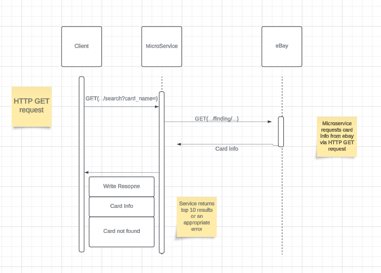

# Setting Up in your Environment
Create a local .venv and .env file to install project dependencies
- Install the following to the local virtual environment:
        - Flask
        - ebaysdk
        - python-dotenv
        - gunicorn (Optional)
- Create a local .env file to define the `PORT` that you will run that application on.
# Contract
## GET /search?card_name
Returns top ten card listings from eBay based on list price.
- Query Params
card_name (required), string
For more information on forming argument view documenation on
https://developer.ebay.com/api-docs/user-guides/static/finding-user-guide/finding-searching-by-keywords.html
- Code: 200
```
{
    code: 200,
    content: [
        "id": int,
        "listingType": string,
        "listingURL": string,
        "price": float,
        "title": string,
        "listingDetails": array[
            object{bidCount: int}(optional),
            object{watchCount: int}(optional),
            object{butItNowPrice: float}(optional)
        ]
    ]
```
- Error responses:
    - Code: 404
    - Content: `{"Error": "Card not found"}

# UML


# Mitigation Plan
1. Implemented for Ben
2. Done
3. N/A
4. They have been added to the repo and can follow the provided
   steps to set up locally to run. The service is also running
   on the OSU server on port 42371
5. They can reach out via Discord, or create an issue in the repository
   if there is a bug
6. ASAP
7. The program assumes the user will create a valid search query. eBay
   documentation has been provided to help form the query.
